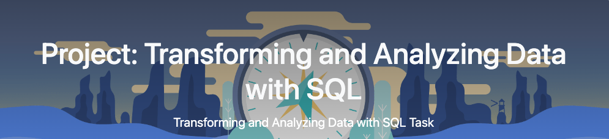

## Project/Goals
 Welcome to my Transforming and Analyzing Data with SQL project! This is the first project in the Lighthouse Labs Data Science bootcamp, at the end of the SQL instruction.
 This project offers a chance for me to integrate all the SQL skills I have acquired so far.

#### Project Overview

In this project, I will amalgamate and apply the knowledge I have gained throughout this course, which includes:

- Retrieving data from a SQL database
- Refining, modifying, and examining data
- Inserting data into a database
- Crafting and executing a QA strategy to verify transformed data in comparison to original data

## Process
### (your step 1)
### (your step 2)

## Results
(fill in what you discovered this data could tell you and how you used the data to answer those questions)

## Challenges 
(discuss challenges you faced in the project)
##### Building the ERD
Finding a suitable primary key for all_sessions and analytics_table was challenging. There was no field that was unique to either table containing no NULL value. The userid column was primarily NULL values so this was useless and I eventually dropped it from the table. I was able to find 2 foreign keys I could use, which I verified via a basic `INNER JOIN`, see example query below.
```sql
SELECT * FROM analytics_table atab JOIN all_sessions asess ON atab.visitid = asess.visitid
SELECT * FROM analytics_table atab JOIN all_sessions asess ON atab.fullvisitorid = asess.fullvisitorid
```
These queries were just used to verify that there is some relationship between the tables and could be use for querying/linking both tables. Another type of join could be used depending on the use case and question we are trying to answer.

##### Answering questions in `starting_with_questions.md` section
1. Had to ignore columns with NULL values and ensure that any window function and or aggregation took this into cconsideration.

## Future Goals
(what would you do if you had more time?)
