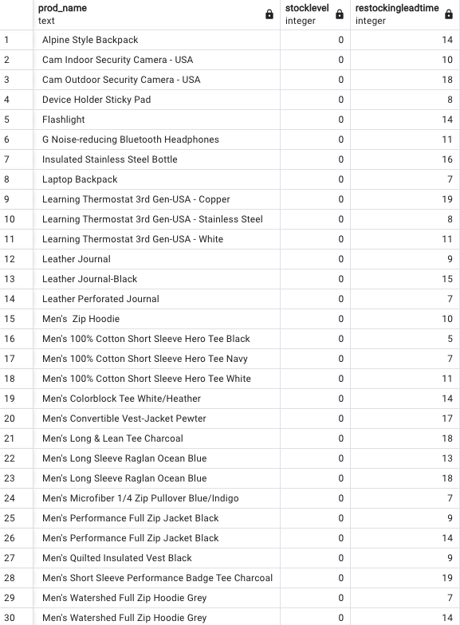

**Question 1: Find all products that are currently out of stock**

SQL Queries:
```sql
SELECT
    DISTINCT(prod_name),
    stocklevel,
    restockingleadtime
FROM
    sales_report
WHERE
    stocklevel = 0
ORDER BY
    prod_name ASC;
```

Answer: \
*77 Products are out of stock*. See sample output below 



**Question 2: Which product was the most unpopular based on sentiment score**

SQL Queries: 
```sql
SELECT
    prod_name,
    count(sentimentscore),
    sentimentscore
FROM
    sales_report
WHERE
    sentimentscore < 0
GROUP BY
    prod_name,
    sentimentscore
ORDER BY
    sentimentscore ASC
LIMIT
    1;
```

Answer: *7 Dog Frisbee*


**Question 3: What were the 5 most popular shopping days**

SQL Queries:
```sql
SELECT
    COUNT(visit_date),
    visit_date
FROM
    analytics_table
GROUP BY
    visit_date
ORDER BY
    COUNT(visit_date) DESC
LIMIT
    5;
```

Answer: 
*The 17th, 18th and 24th of May and the 18th and 31st of August.*


