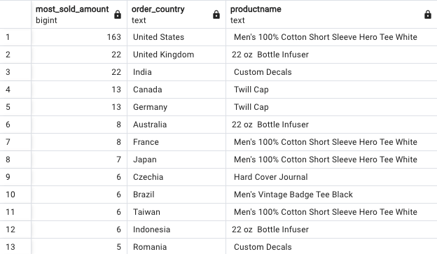
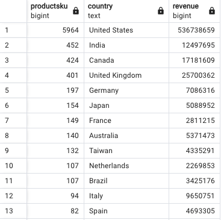

Answer the following questions and provide the SQL queries used to find the answer.

    
**Question 1: Which cities and countries have the highest level of transaction revenues on the site?**


SQL Queries:

```sql
/* data discovery, trying to determine which column to use;
 totaltransactionsrevenue or transactionrevenue */
SELECT
    totaltransactionrevenue,
    transactionrevenue,
    country,
    city
FROM
    all_sessions;

/* removing null values */
SELECT
    totaltransactionrevenue,
    country,
    city
FROM
    all_sessions
WHERE
    totaltransactionrevenue IS NOT NULL;

/*  getting the sum of total transactions revenue per city per country */
SELECT
    sum(totaltransactionrevenue),
    country,
    city
FROM
    all_sessions
where
    totaltransactionrevenue IS NOT NULL
GROUP BY
    country,
    city;

/*getting the sum of total transactions revenue per city per country 
group by country then city and ordered by sum of totaltransactionsrevenue
*/
SELECT
    sum(totaltransactionrevenue),
    country,
    city
FROM
    all_sessions
WHERE
    totaltransactionrevenue IS NOT NULL
GROUP BY
    country,
    city
ORDER BY
    sum(totaltransactionrevenue) DESC;
```


Answer: *Country - United States; City - San Francisco*


**Question 2: What is the average number of products ordered from visitors in each city and country?**


SQL Queries:
``` sql
/* data gathering to see which tables make sense to answer this question */
SELECT * FROM sales_by_sku;
SELECT * FROM all_sessions;

/*order by city and country
Here I'm looking at the sales by sku table to get an idea of all the sales by SKU then getting
the country and city from the sessions table
*/
SELECT
    COUNT(s_sku.total_ordered) AS total_products_ordered,
    country,
    city
FROM
    all_sessions a_sess
    JOIN sales_by_sku s_sku ON a_sess.productsku = s_sku.productsku
GROUP BY
    country,
    city
ORDER BY
    country DESC;

/* Lets now get the average number of products in each country and city */
SELECT
    ROUND(AVG(s_sku.total_ordered), 2) AS total_products_ordered,
    country,
    city
FROM
    all_sessions a_sess
    JOIN sales_by_sku s_sku ON a_sess.productsku = s_sku.productsku
GROUP BY
    country,
    city
ORDER BY
    country DESC;
```


Answer: *See query results*


**Question 3: Is there any pattern in the types (product categories) of products ordered from visitors in each city and country?**


SQL Queries:
``` sql
/* identifying pattern in the products ordered. 
Not using the average this time but using the count of the product skus and updating query to add product name.
The results were ordered by productname to see which products were most popular in each country and city*/
SELECT
    COUNT(s_sku.productsku) AS productsku,
    country,
    city,
    prod.product_name
FROM
    all_sessions a_sess
    JOIN sales_by_sku s_sku ON a_sess.productsku = s_sku.productsku
    JOIN products prod ON prod.sku = s_sku.productsku
WHERE
    a_sess.city != 'not available in demo dataset' -- removing empty cities
GROUP BY
    prod.product_name,
    a_sess.country,
    a_sess.city
ORDER BY
    COUNT(s_sku.productsku) DESC;

/*removing cities and focusing more on the countries to see if there are any trends.
This just shows most popular products in the countries
*/
SELECT
    COUNT(s_sku.productsku) AS productsku,
    country,
    prod.product_name
FROM
    all_sessions a_sess
    JOIN sales_by_sku s_sku ON a_sess.productsku = s_sku.productsku
    JOIN products prod ON prod.sku = s_sku.productsku
GROUP BY
    prod.product_name,
    a_sess.country
ORDER BY
    COUNT(s_sku.productsku) DESC;
```


**Answer**: *Mountain View United States had a lot of home security camera orders and smoke and CO alarms along with twill caps. United Kingdom also had popular twill cap orders. Popular products - US - "Men's 100% cutton short sleeve hero tee white"*


**Question 4: What is the top-selling product from each city/country? Can we find any pattern worthy of noting in the products sold?**


SQL Queries:
```sql
/* using a CTE with a window function we are able to answer this question.
The query from the previous question already has a count of all the products
sold by each country. We will use the table with the CTE however, we need to use
a window function ROW_NUMBER() to assign a rank to each product based on the number of
units sold within each country.

Note: I tried using MAX without the window function but I was unable to get the name of product.
Window function was the next thing to try and it worked*/

WITH total_sku_sold_per_country AS (
    SELECT
        COUNT(s_sku.productsku) AS productsku,
        a_sess.country AS order_country,
        prod.product_name AS productname,
        prod.sku AS psku,
        ROW_NUMBER() OVER (PARTITION BY a_sess.country ORDER BY COUNT(s_sku.productsku) DESC) AS rank
    FROM all_sessions a_sess
    JOIN sales_by_sku s_sku ON a_sess.productsku = s_sku.productsku
    JOIN products prod ON prod.sku = s_sku.productsku
    GROUP BY prod.product_name, a_sess.country, prod.sku
)
SELECT
    productsku AS most_sold_amount,
    order_country,
    productname
FROM total_sku_sold_per_country
WHERE rank = 1
ORDER BY most_sold_amount DESC;
```


Answer: \



**Question 5: Can we summarize the impact of revenue generated from each city/country?**

SQL Queries: 
```sql
/* Summarise the impact of revenue generated from each city/country 
productrevenue is useless, way too many null values

I used the below query to find the lowest priced product to determine best divisor as the product prices have
too many zeroes at the end
*/
select min(productprice) as price from all_sessions where productprice > 0; 
select productprice / 10000 as price from all_sessions;

---
/*
Given that the revenue columns contained a number of null values, to get the revenue, I multiplied
the total number of units ordered per sku multiplied by the product price
*/

SELECT
    COUNT(s_sku.productsku) AS productsku,
    a_sess.country,
    sum(s_sku.total_ordered *(a_sess.productprice / 10000)) as revenue
FROM
    all_sessions a_sess
    JOIN sales_by_sku s_sku ON a_sess.productsku = s_sku.productsku
GROUP BY
    a_sess.country
ORDER BY
    COUNT(s_sku.productsku) DESC;
```


Answer: *The countries with the largest economies have the highest revenues or money spent, see sample below*



